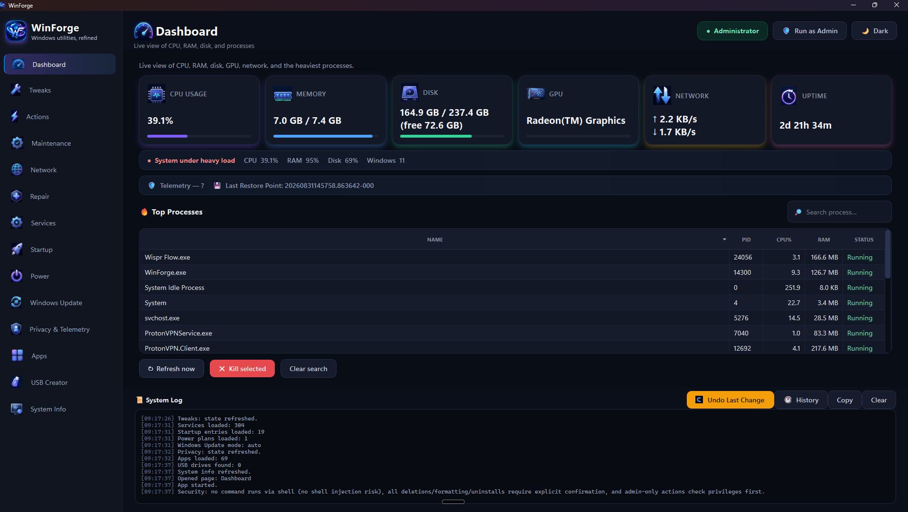
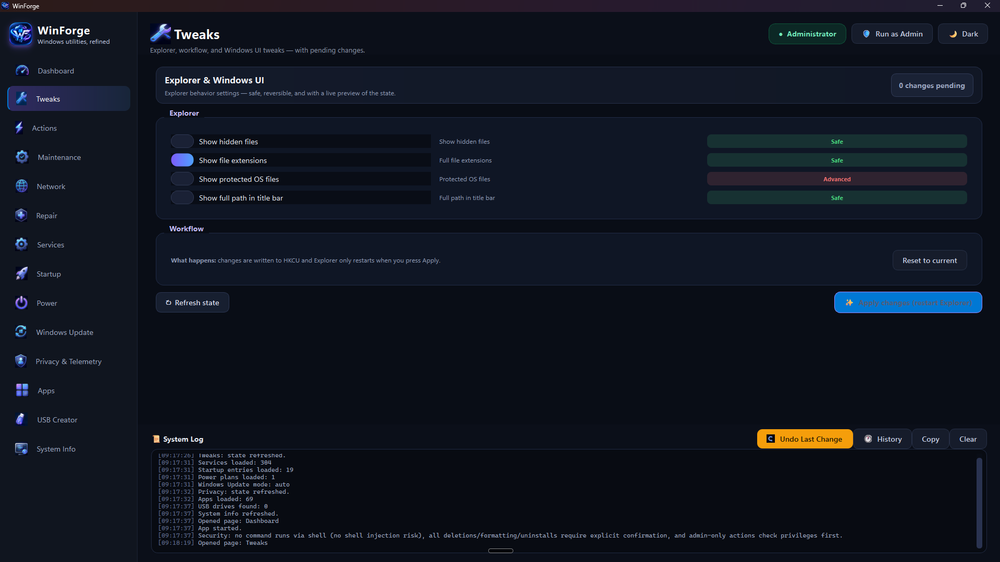
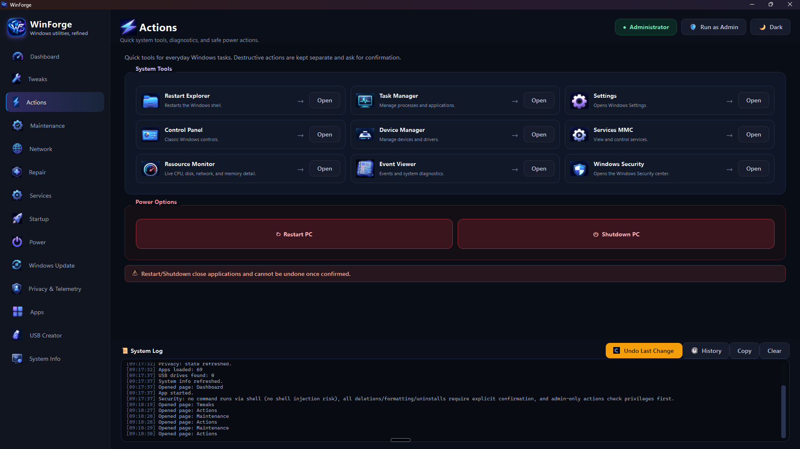
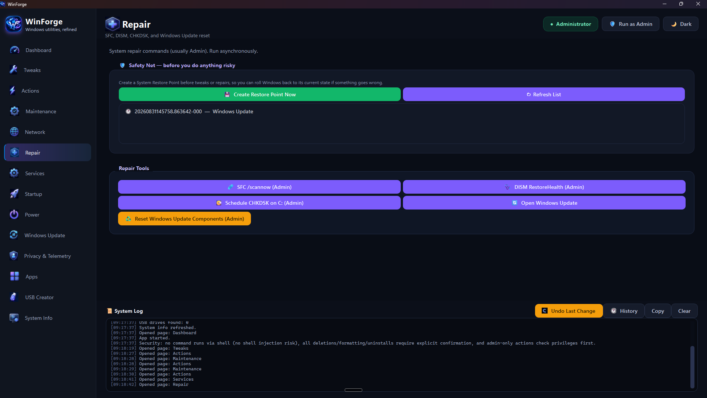

<div align="center">


# WinForge

### Windows utilities, refined.

A modern, all-in-one Windows toolkit for tweaks, privacy, maintenance, repair, and more —
built with Python + PySide6, wrapped in a slick neon dark UI.


</div>

---

## ✨ What is WinForge?

WinForge brings together the tools you'd normally need a dozen different apps for —
system monitoring, privacy control, cleanup, repair, USB creation, and more — into
**one clean, fast, native desktop app.**

**WinForge has this... and much more:**

- 📊 A live **Dashboard** with CPU, RAM, disk, **GPU**, network, and uptime — plus a
  process manager, system health strip, and a one-click **Undo** for your last change
- 🛠️ **Tweaks** with live before/after preview, color-coded risk badges, and a
  side-by-side comparison before anything is applied
- 🛡️ A **Privacy & Telemetry** center with a live *Privacy Score* gauge, one-click
  presets (Max Privacy / Gaming Mode / Standard Debloat), and profile export/import
- 🩹 **Repair tools** (SFC, DISM, CHKDSK, Windows Update reset) guarded by a
  **Safety Net** — create a System Restore Point in one click before you touch anything risky
- 💽 A **USB Creator** that turns any `.iso` into a bootable USB — no separate app needed
- 🌐 **Network tools**: 1-click DNS switching, saved Wi-Fi password viewer, adapter resets
- 🔄 Full **Windows Update control** — automatic, security-only, or fully disabled
- 🚀 **Startup manager** that tells you what each entry actually *is*, not just its filename
- 🎮 **Game Booster Mode**, Windows accent color sync, and a proper Dark/Light theme

---

## 📸 Screenshots

<table>
<tr>
<td width="50%">

<p align="center"><b>Dashboard</b> — live system stats, GPU included</p>
</td>
<td width="50%">

<p align="center"><b>Tweaks</b> — risk badges, live preview, pending changes</p>
</td>
</tr>
<tr>
<td width="50%">

<p align="center"><b>Actions</b> — one-click access to core Windows tools</p>
</td>
<td width="50%">

<p align="center"><b>Repair</b> — Restore Point safety net + repair tools</p>
</td>
</tr>
</table>

---

## 🧩 Feature Overview

| Page | What it does |
|---|---|
| 📊 **Dashboard** | Live CPU / RAM / disk / **GPU** / network / uptime, top processes, system health, Undo & History |
| 🛠️ **Tweaks** | Explorer & Windows UI tweaks with live preview, risk badges, one-click Apply |
| ⚡ **Actions** | Quick launchers for core Windows tools + safe power actions |
| 🧹 **Maintenance** | Temp cleanup, Recycle Bin, DNS flush, large file finder, browser cache cleaner |
| 🌐 **Network** | Diagnostics, 1-click DNS switcher, saved Wi-Fi password viewer |
| 🩹 **Repair** | SFC / DISM / CHKDSK / Windows Update reset, with a Restore Point safety net |
| ⚙️ **Services** | View, start, and stop Windows services |
| 🚀 **Startup** | Enable/disable startup entries — with plain-language explanations |
| 🔋 **Power** | Power plan switching + Game Booster Mode |
| 🔄 **Windows Update** | Automatic / Security-only / Fully disabled, with clear explanations |
| 🛡️ **Privacy & Telemetry** | Live Privacy Score, presets, search, export/import profiles |
| 📦 **Apps** | Install (.exe/.msi/winget) & uninstall applications, runtime installer |
| 💽 **USB Creator** | Bootable USB from any `.iso` |
| ℹ️ **System Info** | System specs + drive health (S.M.A.R.T.) |

---

## 📥 Download

Grab the latest `WinForge.exe` from the **[Releases](../../releases)** tab — no install,
no dependencies, just run it.

> ⚠️ Since WinForge isn't (yet) code-signed, Windows SmartScreen may show an
> **"Unknown Publisher"** warning on first run. This is expected for independent,
> unsigned software — click **More info → Run anyway**. Nothing about this affects
> how the app works. See [Security](#-security) below for how WinForge protects you regardless.

## 🚀 Run from source

```bash
git clone https://github.com/<your-username>/WinForge.git
cd WinForge
pip install pyside6 psutil
python wintoys_like_full_plus_max.py
```

Windows 10/11 only. Most system-level actions require Administrator privileges —
WinForge will offer to relaunch itself elevated when needed.

## 🔨 Build your own .exe

1. Keep `wintoys_like_full_plus_max.py`, `app_icon.ico`, `app_icon.png`,
   `version_info.txt`, `build_exe_max.bat`, and the `page_icons/`, `action_icons/`,
   `dashboard_icons/`, `status_icons/`, `wu_icons/` folders together in one directory.
2. Run `build_exe_max.bat` on a Windows PC with Python installed.
3. Find your built app at `dist\WinForge.exe`.

---

## 🔒 Security

WinForge touches real system settings, so it's built with care:

- **No command ever runs through a shell string** — no `shell=True` anywhere, so
  there's no shell-injection risk from user input.
- **Every destructive action asks first** — uninstalls, USB formatting, disabling
  Windows Update, and similar actions always require explicit confirmation.
- **Admin-only actions check privileges up front** and offer a clean, one-click
  elevation instead of failing silently.
- **Custom configuration is sandboxed** — optional user-supplied privacy-toggle
  configs are restricted to a known-safe allowlist of registry paths.

The full source is right here in this repository — nothing is hidden.

---

## 🤝 Contributing

Issues and pull requests are welcome! If you hit a bug, have an idea, or want to
add a feature, open an issue — or just send a PR.

## 📄 License

WinForge is licensed under the [MIT License](LICENSE) — free to use, modify, and
redistribute. Third-party components (PySide6/Qt, psutil) are used under their
own licenses — see [`THIRD_PARTY_LICENSES.md`](THIRD_PARTY_LICENSES.md).

